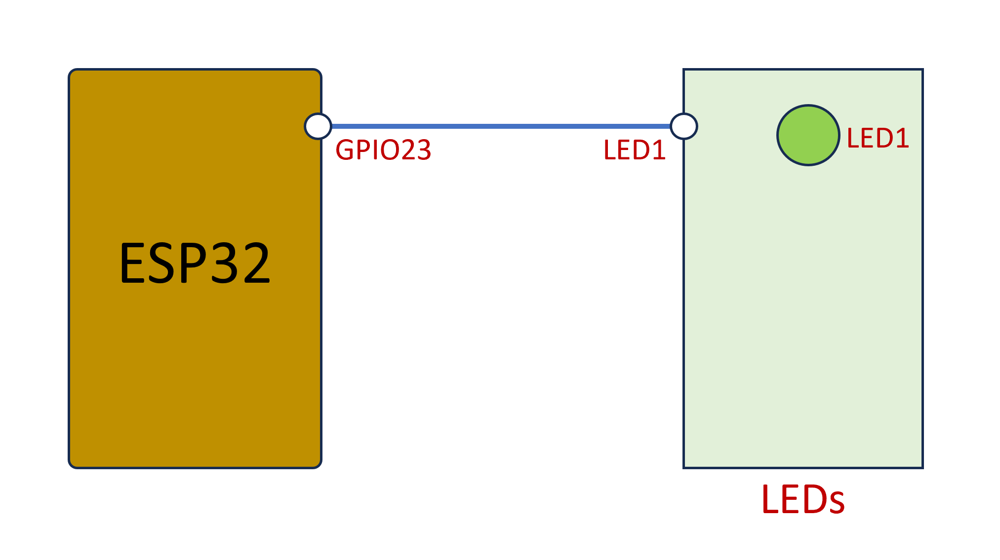

# 3.2 การทำงานกับ ESP-IDF Project

## 1. การทำงานตามสภาวะเริ่มต้นของโปรเจค

### 1.1 เขียนโปรแกรมไฟกระพริบโดยเขียนทั้งหมดใน  main.c  โดยมีเงื่อนไขเบื้องต้นดังนี้

#### 1. ใช้ GPIO จำนวน 1 เส้น

 

#### 2. จังหวะการกระพริบ ติด 0.5 วินาที ดับ 0.5 วินาที

```c
...
    // while loop in app_main() 
    while (true) 
    {
        // Code for turn on LED 
        usleep(500000);
        // Code for turn off LED
        usleep(500000);
    }
...

```

### 1.2 เพิ่มฟังก์ชันต่อไปนี้ลงในไฟล์ main.c

#### 1. LED_INIT() เพื่อกำหนด GPIO ให้กับ LED

#### 2. LED_ON() เพื่อสั่งให้ LED ติด

#### 3. LED_OFF() เพื่อสั่งให้ LED ดับ

### 1.3 ทดสอบโดยการ build และรันโปรแกรม แก้ไขข้อบกพร่อง (ถ้ามี)

## 2. การเพิ่มไฟล์เข้าไปใน ESP-IDF Project

### 2.1 เพิ่มไฟล์ LED.h และ LED.c

### 2.2 ย้าย code สำหรับ LED ไปไว้ใน LED.h และ LED.c

### 2.3 แก้ไข code ใน main.c ให้เรียกฟังก์ชันสำหรับใช้งาน LED

### 2.4 ทดลอง build โปรเจค มี error หรือไม่

### 2.5 แก้ไข Cmakelist.txt ให้มองเห็น LED.h และ build ไฟล์ LED.c 

### 2.6 ทดลอง build และ run โปรเจค