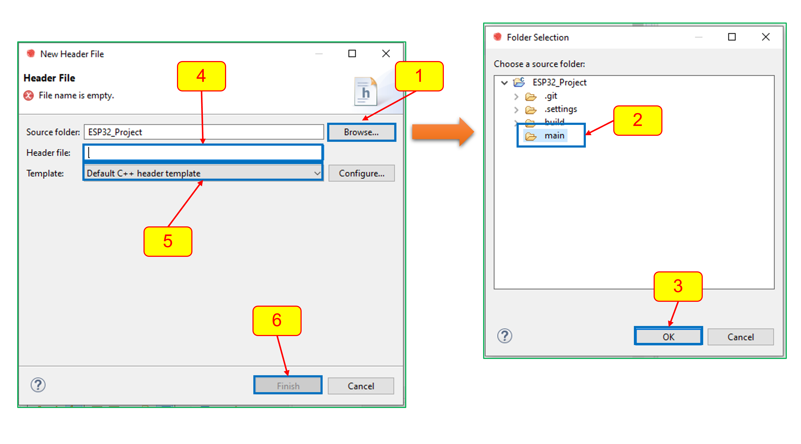
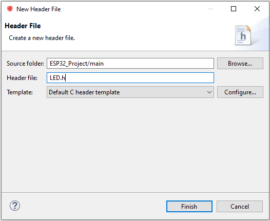
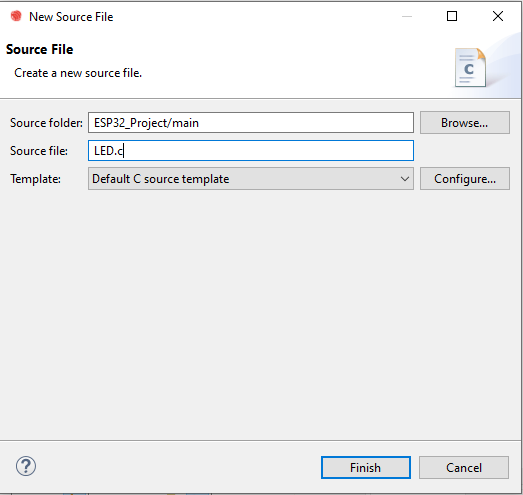

# 3.2 การทำงานกับ ESP-IDF Project

## 1. การทำงานตามสภาวะเริ่มต้นของโปรเจค

### 1.1 เขียนโปรแกรมไฟกระพริบโดยเขียนทั้งหมดใน  main.c  โดยมีเงื่อนไขเบื้องต้นดังนี้

#### 1. ใช้ GPIO จำนวน 1 เส้น

 

#### 2. จังหวะการกระพริบ ติด 0.5 วินาที ดับ 0.5 วินาที


```c
#include <unistd.h>      	// header for usleep()
#include "driver/gpio.h"	// header for gpio

const gpio_num_t LED1 = GPIO_NUM_23; 	//Define name 'GPIO_NUM_23' as 'LED1'

void app_main(void)
{
    gpio_set_direction(LED1, GPIO_MODE_OUTPUT);
    while (true)
    {
        gpio_set_level(LED1, 1);
        usleep(500000);
        gpio_set_level(LED1, 0);
        usleep(500000);
    }
}

```

### 1.2 เพิ่มฟังก์ชันต่อไปนี้ลงในไฟล์ main.c

#### 1. LED_INIT() เพื่อกำหนด GPIO ให้กับ LED

```c
void LED_Init()
{
    gpio_set_direction(LED1, GPIO_MODE_OUTPUT);
}
```

#### 2. LED_ON() เพื่อสั่งให้ LED ติด

```c
void LED_On()
{
    gpio_set_level(LED1, 1);
}
```

#### 3. LED_OFF() เพื่อสั่งให้ LED ดับ

```c
void LED_Off()
{
    gpio_set_level(LED1, 0);
}
```

#### 4. แก้ไข code ใน app_main() ให้เรียกใช้ฟังก์ชันของ LED

```c
void app_main(void)
{
    LED_Init();
    while (true)
    {
        LED_On();
        usleep(500000);
        LED_Off();
        usleep(500000);
    }
}
```


### 1.3 ทดสอบโดยการ build และรันโปรแกรม แก้ไขข้อบกพร่อง (ถ้ามี)

#### code โปรแกรมโดยสมบูรณ์

***หมายเหตุ***  ใช้สำหรับเป็นตัวอย่างเท่านั้น นักศึกษาควรเขียน code ทั้งหมดด้วยตนเอง

```c
#include <unistd.h>      	// header for usleep()
#include "driver/gpio.h"	// header for gpio

const gpio_num_t LED1 = GPIO_NUM_23; 	//Define name 'GPIO_NUM_23' as 'LED1'

void LED_Init()
{
    gpio_set_direction(LED1, GPIO_MODE_OUTPUT);
}

void LED_On()
{
    gpio_set_level(LED1, 1);
}

void LED_Off()
{
    gpio_set_level(LED1, 0);
}

void app_main(void)
{
    LED_Init();
    while (true)
    {
        LED_On();
        usleep(500000);
        LED_Off();
        usleep(500000);
    }
}
```


## 2. การเพิ่มไฟล์เข้าไปใน ESP-IDF Project

### 2.1 เพิ่มไฟล์ LED.h

ขั้นตอนการดำเนินการ
1. ใน ESP-IDF เรียกเมนู `File->New->Header File` จะปรากฏหน้าต่าง New Header File ทำตามขั้นตอนต่อไปนี้

 

1. ถ้า Source Folder ไม่ปรากฏชื่อเพียงชื่อของ project ให้กดปุ่ม Browse...
จะปรากฏหน้าต่าง Folder Selection

2. ในที่นี้ให้เลือกโฟลเดอร์ `main`

3. กดปุ่ม OK

4. ใส่ชื่อ Header file ที่ต้องการ ในที่นี้ให้ใส่ `LED.h`

5. เลือก Template ของ Header file เป็น Default C header template

ก่อนจะกด finish ให้ตรวจสอบการกดำหนดค่าต่าง ๆ ให้เรียบร้อย ดังตัวอย่าง

 

6. กด Finish 

นอกจากนี้ยังสามารถคลิกขวาที่ชื่อโฟลเดอร์ main แล้วเลือก new header file ได้เช่นกันซึ่งจะประหยัดเวลาได้เล็กน้อย

### 2.2 เพิ่มไฟล์ LED.c
ใช้แนวทางเดียวกันในการเพิ่มไฟล์ LED.c โดยเลือกเมนู `File->New->Source File`
ตรวจสอบที่ตั้งไฟล์ ชื่อไฟล์ และ ชนิดของ template ว่าเป็นไปตามภาพตัวอย่างต่อไปนี้ แล้วกด finish

 


### 2.3 เพิ่ม code ใน LED.h

เพิ่มการประกาศรูปแบบฟังก์ชันไว้ในไฟล์ LED.h ดังนี้

```c
#ifndef MAIN_LED_H_
#define MAIN_LED_H_

// add 3 functions prototype
void LED_Init();    
void LED_On();
void LED_Off();

#endif /* MAIN_LED_H_ */
```

### 2.4 ย้าย code จาก main.c มาไว้ใน LED.c

ในไฟล์ LED.c
```c
... 
void LED_Init()
{
	gpio_set_direction(LED1, GPIO_MODE_OUTPUT);
}

void LED_On()
{
	gpio_set_level(LED1, 1);
}

void LED_Off()
{
	gpio_set_level(LED1, 0);
}
```
## ลอง Build project จะมี Error หลายอย่าง เราจะต้องแก้ไขไปทีละอย่าง

```
D:/GitHubRepos/__ENGEDU/2023_Special_topics-Computer/ESP32_Project/main/main.c:9:2: error: implicit declaration of function 'LED_Init' [-Werror=implicit-function-declaration]
  LED_Init();
  ^~~~~~~~
D:/GitHubRepos/__ENGEDU/2023_Special_topics-Computer/ESP32_Project/main/main.c:12:3: error: implicit declaration of function 'LED_On' [-Werror=implicit-function-declaration]
   LED_On();
   ^~~~~~
D:/GitHubRepos/__ENGEDU/2023_Special_topics-Computer/ESP32_Project/main/main.c:14:3: error: implicit declaration of function 'LED_Off' [-Werror=implicit-function-declaration]
   LED_Off();
   ^~~~~~~
```

error ด้านบนนี้เกิดขึ้นเนื่องจาก compiler ไม่รู้จักฟังก์ชันทั้งสาม เราต้องทำการบอกให้รู้ โดยการใส่ `#include "LED.h"` ไว้ที่ส่วนหัวของไฟล์ main.c

```c
#include <unistd.h>      	// header for usleep()
#include "driver/gpio.h"	// header for gpio

#include "LED.h"            // LED functions declaration files 

const gpio_num_t LED1 = GPIO_NUM_23; 	//Define name 'GPIO_NUM_23' as 'LED1'


void app_main(void)
{
   ...
```

## ลอง Build project อีกครั้ง  Error เหล่านั้นหายไปแล้ว แต่จะมี error อย่างอื่นขึ้นมาแทน


```
c:/espressif/espressif/tools/xtensa-esp32-elf/esp-2021r2-patch5-8.4.0/xtensa-esp32-elf/bin/../lib/gcc/xtensa-esp32-elf/8.4.0/../../../../xtensa-esp32-elf/bin/ld.exe: esp-idf/main/libmain.a(main.c.obj):(.literal.app_main+0x0): undefined reference to `LED_Init'
c:/espressif/espressif/tools/xtensa-esp32-elf/esp-2021r2-patch5-8.4.0/xtensa-esp32-elf/bin/../lib/gcc/xtensa-esp32-elf/8.4.0/../../../../xtensa-esp32-elf/bin/ld.exe: esp-idf/main/libmain.a(main.c.obj):(.literal.app_main+0x4): undefined reference to `LED_On'
c:/espressif/espressif/tools/xtensa-esp32-elf/esp-2021r2-patch5-8.4.0/xtensa-esp32-elf/bin/../lib/gcc/xtensa-esp32-elf/8.4.0/../../../../xtensa-esp32-elf/bin/ld.exe: esp-idf/main/libmain.a(main.c.obj):(.literal.app_main+0x8): undefined reference to `LED_Off'
c:/espressif/espressif/tools/xtensa-esp32-elf/esp-2021r2-patch5-8.4.0/xtensa-esp32-elf/bin/../lib/gcc/xtensa-esp32-elf/8.4.0/../../../../xtensa-esp32-elf/bin/ld.exe: esp-idf/main/libmain.a(main.c.obj): in function `app_main':
D:/GitHubRepos/__ENGEDU/2023_Special_topics-Computer/ESP32_Project/main/main.c:9: undefined reference to `LED_Init'
```

สรุปได้ว่า error ที่เกิดขึ้นคือ 

```
undefined reference to `LED_Init'
undefined reference to `LED_On'
undefined reference to `LED_Off'
```
ทั้งนี้ เนื่องมากจากฟังก์ชันเหล่านั้นอยู่ในไฟล์ LED.c ซึ่งยังเป็นไฟล์ที่ไม่ใช่สมาชิกของการ build นั่นเอง

วิธีการแก้ปัญหาคือเราต้องบอกให้ตัว build นำไฟล์ LED.c มาใช้ในการร่วมสร้าง project นี้ด้วย ซึ่งต้องไประบุไว้ในไฟล์ CMakeList.txt


### 2.5 แก้ไข Cmakelist.txt ให้ดึงไฟล์ LED.c มารวมในการ build 

เปืดไฟล์  CMakeList.txt ในโฟลเดอร์ main ขึ้นมาใน text editor 

## ระวัง!!! จะสังเกตุว่ามี CMakeList.txt อยู่ในทุก folder  

### ในที่นี้ให้เรียกไฟล์ที่อยู่ในโฟลเดอร์ main
เนื้อหาใน main/CMakeList.txt


```CMake
# See the build system documentation in IDF programming guide
# for more information about component CMakeLists.txt files.

idf_component_register(
    SRCS main.c         # list the source files of this component
    INCLUDE_DIRS        # optional, add here public include directories
    PRIV_INCLUDE_DIRS   # optional, add here private include directories
    REQUIRES            # optional, list the public requirements (component names)
    PRIV_REQUIRES       # optional, list the private requirements
)
```

ให้เพิ่ม LED.c ต่อท้าย main.c โดยเว้นอย่างน้อย 1 เคาะ

```CMake
# See the build system documentation in IDF programming guide
# for more information about component CMakeLists.txt files.

idf_component_register(
    SRCS main.c LED.c        # list the source files of this component
    INCLUDE_DIRS        # optional, add here public include directories
    PRIV_INCLUDE_DIRS   # optional, add here private include directories
    REQUIRES            # optional, list the public requirements (component names)
    PRIV_REQUIRES       # optional, list the private requirements
)
```

## ลอง Build project อีกครั้ง  Error เหล่านั้นหายไปแล้ว แต่จะมี error อย่างอื่นขึ้นมาแทน


```
D:/GitHubRepos/__ENGEDU/2023_Special_topics-Computer/ESP32_Project/main/LED.c: In function 'LED_Init':
D:/GitHubRepos/__ENGEDU/2023_Special_topics-Computer/ESP32_Project/main/LED.c:10:2: error: implicit declaration of function 'gpio_set_direction' [-Werror=implicit-function-declaration]
  gpio_set_direction(LED1, GPIO_MODE_OUTPUT);
  ^~~~~~~~~~~~~~~~~~
D:/GitHubRepos/__ENGEDU/2023_Special_topics-Computer/ESP32_Project/main/LED.c:10:21: error: 'LED1' undeclared (first use in this function)
  gpio_set_direction(LED1, GPIO_MODE_OUTPUT);
                     ^~~~
D:/GitHubRepos/__ENGEDU/2023_Special_topics-Computer/ESP32_Project/main/LED.c:10:21: note: each undeclared identifier is reported only once for each function it appears in
D:/GitHubRepos/__ENGEDU/2023_Special_topics-Computer/ESP32_Project/main/LED.c:10:27: error: 'GPIO_MODE_OUTPUT' undeclared (first use in this function)
  gpio_set_direction(LED1, GPIO_MODE_OUTPUT);
                           ^~~~~~~~~~~~~~~~
D:/GitHubRepos/__ENGEDU/2023_Special_topics-Computer/ESP32_Project/main/LED.c: In function 'LED_On':
D:/GitHubRepos/__ENGEDU/2023_Special_topics-Computer/ESP32_Project/main/LED.c:15:2: error: implicit declaration of function 'gpio_set_level' [-Werror=implicit-function-declaration]
  gpio_set_level(LED1, 1);
  ^~~~~~~~~~~~~~
D:/GitHubRepos/__ENGEDU/2023_Special_topics-Computer/ESP32_Project/main/LED.c:15:17: error: 'LED1' undeclared (first use in this function); did you mean 'LED_On'?
  gpio_set_level(LED1, 1);
                 ^~~~
                 LED_On
D:/GitHubRepos/__ENGEDU/2023_Special_topics-Computer/ESP32_Project/main/LED.c: In function 'LED_Off':
D:/GitHubRepos/__ENGEDU/2023_Special_topics-Computer/ESP32_Project/main/LED.c:20:17: error: 'LED1' undeclared (first use in this function); did you mean 'LED_On'?
  gpio_set_level(LED1, 0);
                 ^~~~
                 LED_On
```

error ที่เกิดขึ้นจะอยู่ในไฟล์ LED.c ซึ่งเกิดจากการไม่รู้จักฟังก์ชันเกี่ยวกับ gpio รวมทั้งตัวแปร `LED1` เราต้องเพิ่ม `#include "driver/gpio.h` 
และ `extern gpio_num_t LED1;` ในไฟล์  `LED.c`

```c
// LED.c
#include "driver/gpio.h"    // for gpio function
extern gpio_num_t LED1;     // LED1 in gpio function parameter

void LED_Init()
{
    gpio_set_direction(LED1, GPIO_MODE_OUTPUT);
}

void LED_On()
{
    gpio_set_level(LED1, 1);
}

void LED_Off()
{
    gpio_set_level(LED1, 0);
}
```


## ลอง Build project อีกครั้ง  ถ้าไม่มี Error แล้วก็ให้ลองรันดู...

#  บันทึกผลการทดลอง 

1. ส่งงานเป็น repo ของ project ที่ทำในใบงานนี้ 

2. ถ่ายคลิปการทำงานของโปรแกรม ส่งขึ้นไปไว้บน youtube แล้วทำ link ไว้ใน readme.md ของ repo ใบงาน 


## [เฉลยใบงาน (ให้ดูเป็นอ้างอิง ห้าม copy-paste)](./3.2.1-Lab-keys.md)
